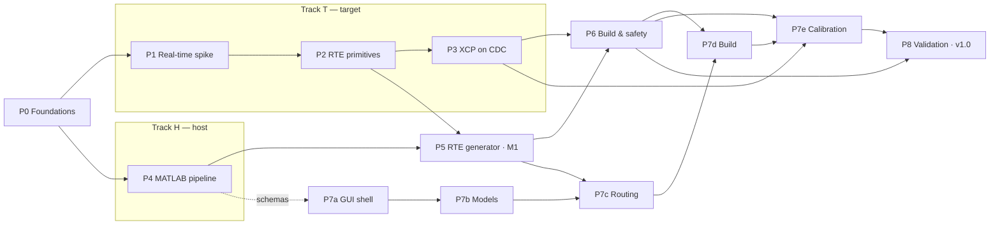

# PicoDesk Implementation Plan

Phased implementation of [REQUIREMENTS.md](REQUIREMENTS.md) (SRS v7.0). Every phase names the
requirement IDs it implements and ends with measurable exit criteria — a phase is done when its
criteria pass on hardware, not when its code merges.

## Strategy

1. **De-risk the hard real-time core first.** NFR-1 (≤50 µs p99.99 jitter) and NFR-3 (15 µs
   critical-section budget) are the requirements most likely to invalidate the architecture. They
   are proven on a hand-written spike firmware in Phases 1–3, *before* any codegen automation is
   built on top.
2. **Two parallel tracks after Phase 0.** Track T (target: Phases 1→2→3) and Track H (host
   pipeline: Phases 4→5) share only the descriptor/routing schemas. The GUI (Phase 7) starts
   against mocked backends as soon as those schemas freeze.
3. **Hardware-in-the-loop always.** Exit criteria run on a real Pico. SIL is out of scope (SRS
   §1.3), but plain unit tests of portable C (seqlock, ring buffer) on the host are not SIL and
   are used freely.
4. **Traceability.** Commits, tests, and reviews cite requirement IDs. The matrix at the bottom
   maps every ID to its implementing phase; Phase 8 re-validates all of them as a gate for v1.0.

**Prerequisites:** 2× Raspberry Pi Pico, a logic analyzer (NFR-1 measurement), Windows + Linux x64
test machines, MATLAB R2023b–R2024b license.

## Status

| Phase | Code | Automated verification | Open |
|---|---|---|---|
| P0 Foundations | done | CI: lint, pytest, double-build UF2 hash match (BLD-008) | — |
| P1 Real-time spike | done | CI: memory-bank audit (BLD-001/002), Renode boot + 1 kHz dispatch | NFR-1 jitter campaign (logic analyzer) |
| P2 RTE primitives | done | CI: native pthread stress (seqlock/ring/CAL), Renode primitive health | 24 h on-target soak |
| P3 XCP on CDC | done | CI: XCP protocol suite (native) against both slaves; Renode system suite on the XCPlite build | 50 sig × 100 Hz DAQ soak, which is what gates making XCPlite the default |
| P4 MATLAB pipeline | done | CI: 19 fake-engine tests. Local R2025b: real .slx extraction, MAT-002, NFR-2 gate, SIGKILL recovery, ERT codegen | — (SRS v7.1 pins R2025b, the release in use) |
| P5 RTE generator | done — **M1 met** | CI: 12 generator tests + generated firmware built and run on emulated RP2040 (ASW↔ASW round trip closes) | — (ERT step code and array signals both landed) |
| P6 Build & safety | done | CI: sizing gate + map calibration (BLD-004, ±1%), fault/watchdog drills in Renode (BLD-006/007), A2L DWARF patching (CAL-002), reproducibility with `-g` (BLD-008). Local: NFR-2 = 1.4 s on a 28-model workspace (budget 45 s) | HardFault *exception dispatch* (emulator halts instead of vectoring) — hardware drill |
| P7 GUI | done | CI: 36 GUI tests (view-model rules + headless widget rendering via offscreen Qt), screenshots rendered as artifacts | live MATLAB/CMake wiring behind the page actions; freeze-budget measurement under real load |
| P8 Validation | done — **v1.0 blocked** | CI: traceability report (33/33 requirements, self-verifying), Windows job, 28-model scale workspace built + run in Renode. Docs: user guide, licence inventory, release readiness | 7 hardware gates + Qt licensing decision; see docs/RELEASE_READINESS.md |

**Simulation caveat:** Renode validates function, not timing — virtual time is not real time, and
USB is unmodeled. NFR-1/NFR-3 numbers come only from hardware.

---

## Phase 0 — Foundations & walking skeleton

**Goal:** every later phase lands on working rails: pinned toolchain, CI, one reproducible UF2.

- Pin and vendor dependencies: Pico SDK ≥ 1.5.1, FreeRTOS-Kernel ≥ 11.1.0 (SMP) as submodules;
  Vector XCPlite vendored into `target/xcplite/vendor/` with its MIT `LICENSE` retained
  (SRS §8; the Apache-2.0 attribution was wrong and was corrected in v7.1).
- CI: `ruff` + `pytest` for `host/`; firmware build in a container with ARM GCC 12.2.rel1;
  double-build SHA-256 comparison of the UF2 as a reproducibility gate (BLD-008 groundwork —
  the flags already exist in `target/CMakeLists.txt`).
- Minimal CLI dependency check (`picodesk.buildsys.dependency_checker`): gcc / CMake / SDK / MATLAB
  presence and versions — the same logic the GUI later calls for GUI-004.
- Blink firmware builds, flashes, runs; `pip install -e "host[dev]"` and the smoke test pass.

**Exit criteria:** CI green on Linux + Windows; two successive clean builds yield identical UF2
hashes; dependency check reports correct versions on both platforms.
**Size:** ~1 week.

## Phase 1 — Target real-time spike *(Track T)*

**Goal:** prove the dual-core execution model with hand-written code. Covers RTE-002 (dispatch),
BLD-001, BLD-002; establishes the NFR-1/NFR-3 measurement method.

- Bank-separated linker script `target/ld/rp2040_banked.ld` from SDK `memmap_default.ld`:
  Core 0 stack/BSS → SRAM0, Core 1 → SRAM1, shared RTE data + FreeRTOS heap → SRAM2, plus the
  `.noinit_fault` section (used in Phase 6).
- FreeRTOS SMP bring-up (`configNUMBER_OF_CORES = 2`): scheduler running, Core 0 hosting only the
  idle task, Core 1 hosting application tasks.
- Core 0 hardware timer alarm ISR at 1 kHz, `__not_in_flash_func`, calling hand-written toy
  "model steps"; 10 ms / 100 ms toy rate groups on Core 1 released via `vTaskNotifyGiveFromISR()`.
- Instrumentation: GPIO toggle at ISR entry for the logic analyzer; cycle-counter capture of
  ISR execution time; spinlock/IRQ-mask hold-time probes for the NFR-3 audit.
- Soak: 1 000 000 cycles, jitter histogram from the logic analyzer (no XCP load yet).

**Exit criteria:** jitter ≤ 50 µs p99.99 unloaded; zero overruns in the soak; map file confirms
bank placement and SRAM execution of the fast path; longest measured critical section < 15 µs.
**Size:** 2–3 weeks. **Depends:** Phase 0.

## Phase 2 — RTE runtime primitives *(Track T)*

**Goal:** the concurrency layer the generated code will instantiate. Covers RTE-001, RTE-003,
RTE-004, RTE-005 (runtime side), BLD-003 (counters), and the `hal_manifest.json` contract (GUI-006).

- Seqlock (`target/rte/rte_seqlock.h/.c`): writer masks local IRQs only; reader bounded to 3
  retries then last-known-good + fault counter. Host-native unit tests plus an on-target two-core
  torture test with a torn-read detector.
- Copy-in shadow buffers and boot-time zero/producer-default init (RTE-001, RTE-004).
- CAL page manager (`rte_calpage`): dual RAM pages in SRAM2; Core 1 writes offline page only;
  Core 0 commits the pointer swap solely at the step boundary (RTE-003).
- DAQ ring (`rte_daq_ring`): SPSC, coherent whole-frame push from the ISR, drain API for Core 1,
  overflow counted not blocked (RTE-005).
- Telemetry block in SRAM2: ISR exec time (64-bit µs timer), overrun count, seqlock faults,
  heartbeat (BLD-003); default HAL implementation (GPIO/ADC/PWM) with ISR-safe functions matching
  `target/hal/hal_manifest.json`.

**Exit criteria:** unit tests green; 24 h on-target soak with cross-core traffic shows zero torn
reads, bounded retries, correct stale-fallback behavior; CAL page swap observed to be atomic
across a multi-parameter change; NFR-3 audit still passes with primitives in use.
**Size:** 2–3 weeks. **Depends:** Phase 1.

## Phase 3 — XCP on CDC *(Track T)*

**Goal:** calibration/measurement transport proven at load — the real NFR-1 gate. Covers CAL-001.

- TinyUSB CDC-ACM transport shim for XCPlite (`target/xcplite/port/picodesk_xcp_tl.c`), running in
  the Core 1 XCP task at lowest priority (BLD-005 policy).
- XCPlite wired to Phase 2 primitives: DAQ lists fed from the ring, `SET_CAL_PAGE`/`GET_CAL_PAGE`
  driving the CAL page manager.
- Hand-written A2L for the spike firmware; `pyxcp` host scripts (early `picodesk.xcp.master`):
  connect, upload/download, page switch, DAQ start/stop.
- Load test: ≥ 50 signals at 100 Hz for 30+ minutes while the logic analyzer re-runs the Phase 1
  jitter campaign.

**Exit criteria:** sustained 50 × 100 Hz DAQ with no uncounted frame loss; **jitter ≤ 50 µs
p99.99 under full DAQ load over 1 M cycles (NFR-1 as specified)**; page switch is transactional
under concurrent DAQ.
**Size:** ~2 weeks. **Depends:** Phase 2.

## Phase 4 — MATLAB extraction pipeline *(Track H — parallel to Phases 1–3)*

**Goal:** `.slx` batch → validated JSON descriptor → ERT code, hash-gated. Covers MAT-001,
MAT-002, MAT-003, GUI-001/GUI-002 backends, NFR-2 groundwork.

- `MatlabSession`: persistent `matlab.engine` with crash detection and restart (GUI-002);
  version-alignment check between Python and the installed MATLAB.
- Batch extractor: directory scan, content hash per `.slx`, compile-in-memory I/O interrogation →
  monolithic descriptor JSON (ports, data types, dimensions, fixed-point scaling, base rates).
  **Freeze descriptor schema v1 (JSON Schema)** — the Track H/T/GUI contract.
- Hash gating: unchanged hash ⇒ skip ERT re-generation (NFR-2); stale flag surfaced per model
  (GUI-001).
- ERT configuration per model: per-model symbol prefixing, A2L generation against the
  `RAM_SHARED` segment (MAT-003); compiled-metrics parse rejecting `single`/`double` in fast-loop
  models as a hard error (MAT-002).
- Fixture suite: 4–5 reference `.slx` models (fast fixed-point, slow with `double`, multi-rate,
  deliberately-broken float-in-fast-loop) with golden descriptors.

**Exit criteria:** fixtures extract and regenerate deterministically; MAT-002 case fails the
pipeline with a pointed error; re-run with no changes performs zero ERT invocations; session
survives a forced MATLAB kill.
**Size:** ~3 weeks. **Depends:** Phase 0 only (runs parallel to Track T).

## Phase 5 — RTE generator & first end-to-end firmware *(tracks merge)*

**Goal:** descriptor + routing config → generated C that instantiates Phase 2 primitives and runs
real ERT model code on hardware. Covers RTE-001..005 (codegen side), BLD-005, GUI-003 (schema),
GUI-006 (validation).

- **Routing config JSON schema v1, versioned with migration hooks (GUI-003).** Validation rules:
  single writer per inport (GUI-009 backend), exact type/dimension/scaling match (GUI-008
  backend), HAL ISR-safety check against the manifest (GUI-006), full-mesh ASW↔ASW and ASW↔HAL
  edges as first-class.
- Edge classification: same-rate/same-core → direct copy-in; cross-rate/cross-core → ZOH +
  seqlock instantiation (GUI-010 semantics, RTE-004).
- Jinja templates (`host/picodesk/rtegen/`): dispatch table for Core 0 ISR + Core 1 task loops
  with notify wiring (RTE-002), shadow buffers (RTE-001), seqlock instances, CAL page parameter
  tables (RTE-003), DAQ config (RTE-005), task priority/stack tables — rate-monotonic, XCP
  lowest, 2 kB defaults, HWM instrumentation (BLD-005), `__not_in_flash_func` on every fast-path
  emission (BLD-001).
- Static checks on generated output: no float symbols in fast-path objects (MAT-002 backstop),
  symbol-prefix collision scan across models (MAT-003).

**Exit criteria (integration milestone M1):** two real ERT models cross-wired both directions
(ASW↔ASW) plus HAL I/O build, flash, and run with correct data flow; a 28-model synthetic
workspace generates, links within memory, and passes the NFR-3 audit; regenerating an unchanged
workspace is byte-identical.
**Size:** 3–4 weeks. **Depends:** Phases 2 and 4 (Phase 3 for the DAQ config path).

## Phase 6 — Build orchestration, safety & reproducibility

**Goal:** the unattended pipeline around the generator, plus the fault-tolerance directives.
Covers GUI-004, BLD-004, BLD-006, BLD-007, BLD-008, CAL-002, NFR-2.

- CMake driver (`buildsys.cmake_driver`): configure/build/relink with streamed, parse-friendly
  output (feeds GUI-005); end-to-end **routing-only change benchmark ≤ 45 s (NFR-2)** on the
  reference workspace.
- Sizing estimator + report (BLD-004): pre-CMake RAM/flash estimate per bank, halt above
  200 kB SRAM / 1.5 MB flash; cross-checked against the linker map for calibration.
- Reproducibility verification (BLD-008): double-build hash compare promoted to a release gate.
- HardFault capture (BLD-006): handler stores stacked PC/LR + fault status into `.noinit_fault`
  with a magic word; printed on next boot; fault-injection test (deliberate hardfault → watchdog
  reset → report survives).
- Cross-core watchdog (BLD-007): Core 1 task verifies Core 0 heartbeat advancement before feeding
  the hardware watchdog; injection tests for a stuck ISR and a stuck Core 1 task.
- A2L post-processing (CAL-002): `pyelftools` DWARF walk resolving nested Simulink struct member
  VMAs against GCC 12 DWARF output; patched A2L validated by connecting `pyxcp` to generated
  firmware and reading known parameter values.

**Exit criteria:** NFR-2 benchmark met; sizing report within ±10 % of linker truth on the
reference workspace; both fault injections recover with correct post-mortem; A2L round-trip
(write via XCP, read back, verify in MDF4) passes on generated firmware.
**Size:** ~2–3 weeks. **Depends:** Phase 5 (CAL-002 also on Phase 3).

## Phase 7 — GUI

**Goal:** the PyQt6 application per the Pencil design (`picodeskgui.pen`), consuming the backends
built in Phases 4–6. Sub-phases ship in order; 7a can start on mocks as soon as Phase 4 freezes
the schemas.

- **7a — Shell:** sidebar navigation, workspace open/save with schema-version migration prompt
  (GUI-003), dependency status surface (GUI-004), diagnostic console with regex-parsed,
  color-coded, source-hyperlinked MATLAB/CMake streams (GUI-005). All long work off the UI thread.
- **7b — Models screen:** import, hash/staleness states (GUI-001), MAT-002 blocked state, MATLAB
  session chip (GUI-002), I/O detail panel.
- **7c — Routing matrix:** 3-pane Producers/Connections/Consumers (GUI-007) with full-mesh
  ASW↔ASW support and topology filters; live type/dimension/scaling filtering of consumer ports
  (GUI-008); locked inports + cascade delete on model removal (GUI-009); ZOH/Seqlock rate badges
  (GUI-010); Suggest Bindings wizard with preview and single-step undo (GUI-011).
- **7d — Build screen:** pipeline stages with cache states, sizing report visualization
  (BLD-004), reproducibility badge (BLD-008), build/flash actions gated on dependency checks.
- **7e — Calibration dashboard (GUI-012):** XCP connect over CDC, offline-page parameter editing
  with pending-change tracking and step-boundary page switch (RTE-003 semantics), DAQ signal
  selection + live plots, MDF4 recording via `asammdf`, telemetry tiles (BLD-003) and stack
  high-water display (BLD-005).

**Exit criteria:** every REQ-GUI acceptance criterion demonstrated against real backends on the
reference workspace; UI review against the Pencil deck; no UI freeze > 100 ms during import,
build, or DAQ streaming.
**Size:** 4–6 weeks wall-clock, overlapping Phases 5–6. **Depends:** 7a/7b on Phase 4; 7c on
Phase 5; 7d on Phase 6; 7e on Phases 3 + 6.

## Phase 8 — System validation & v1.0

**Goal:** prove the SRS end-to-end, on both host platforms, and tag v1.0.

- Traceability run: one scripted acceptance test per requirement ID (the matrix below is the
  checklist); results archived per run.
- Formal NFR-1 campaign: logic analyzer, 1 M cycles, full 28-model workspace, 50-signal DAQ.
- Scale + endurance: 28–30 model workspace, 48 h soak with live tuning and MDF4 logging;
  watchdog/fault drills repeated on the full build.
- Cross-platform validation on clean Windows and Linux x64 machines (install → import → build →
  tune); packaging and versioned release artifacts.
- Docs: user guide, toolchain setup, third-party license inventory (XCPlite MIT retention
  verified).

**Exit criteria:** all acceptance tests green on both platforms; NFR-1/2/3 reports archived;
v1.0 tagged.
**Size:** ~2 weeks. **Depends:** Phases 6 and 7.

---

## Dependency graph

With Track T and Track H staffed in parallel and the GUI overlapping from Phase 4 onward, the
critical path is roughly P0 → P1 → P2 → P3/P5 → P6 → P7e → P8 — on the order of **4–5 months**
for a 2-engineer team. Single-engineer execution serializes the tracks (≈ 7–8 months). Treat
these as planning aids, not commitments; the exit criteria, not the calendar, gate each phase.

## Risk register

| # | Risk | Phase | Mitigation |
|---|------|-------|------------|
| 1 | SMP spinlock contention breaks the 15 µs budget (NFR-3) | P1–P3 | Hold-time probes from day one; keep Core 0 out of kernel calls entirely; fast path never takes the kernel lock |
| 2 | CDC throughput can't sustain 50 sig × 100 Hz (CAL-001) | P3 | Early load test on spike firmware; frame batching in the transport shim; ring sized for burst tolerance |
| 3 | TinyUSB servicing perturbs Core 0 (NFR-1 under load) | P3 | USB IRQs pinned to Core 1; jitter campaign repeated under DAQ before any codegen work builds on it |
| 4 | MATLAB Engine ↔ Python version misalignment breaks installs | P4 | Hard version check at startup (GUI-004); documented support matrix; CI against two MATLAB releases |
| 5 | ERT A2L segment/format quirks vs. custom linker (MAT-003) | P4–P6 | Golden-fixture A2L diffs; CAL-002 DWARF patching validates addresses against the ELF, not trust in ERT |
| 6 | `pyelftools` vs. GCC 12 DWARF v5 gaps (CAL-002) | P6 | Spike the DWARF walk on Phase 3's firmware early; fallback: `-gdwarf-4` build flag |
| 7 | 264 kB SRAM pressure at 28–30 models (BLD-004) | P5 | Synthetic 28-model workspace in M1; sizing estimator calibrated against maps before GUI-driven builds |
| 8 | GUI freezes during long MATLAB/CMake operations | P7 | All backends async from 7a; console streaming decoupled via queues; freeze budget in exit criteria |

## Traceability matrix

| Requirement | Implemented | Validated |
|---|---|---|
| GUI-001 | P4 (backend), P7b (UI) | P8 |
| GUI-002 | P4 (backend), P7a (UI) | P8 |
| GUI-003 | P5 (schema), P7a (migration UI) | P8 |
| GUI-004 | P0 (CLI), P7a (UI) | P8 |
| GUI-005 | P7a (+ streams from P4/P6) | P8 |
| GUI-006 | P2 (manifest), P5 (validation), P7c (UI) | P8 |
| GUI-007–011 | P5 (rules), P7c (UI) | P8 |
| GUI-012 | P3 (slave), P7e (UI) | P8 |
| MAT-001 / 002 / 003 | P4 | P5, P8 |
| RTE-001 / 004 / 005 | P2 (runtime), P5 (codegen) | P2/P3 soaks, P8 |
| RTE-002 | P1 (spike), P5 (codegen) | P1, P8 |
| RTE-003 | P2 (runtime), P3 (XCP), P5 (tables) | P3, P8 |
| BLD-001 / 002 | P1 (+ P5 templates) | P1 map audit, P8 |
| BLD-003 | P2 (counters), P7e (display) | P8 |
| BLD-004 | P6 | P6, P8 |
| BLD-005 | P5 (generation), P2 (HWM), P7e (display) | P8 |
| BLD-006 / 007 | P6 | P6 injections, P8 drills |
| BLD-008 | P0 (flags/CI), P6 (gate) | every CI run, P8 |
| CAL-001 | P3 | P3 load test, P8 |
| CAL-002 | P6 | P6 round-trip, P8 |
| NFR-1 | P1 (method) | P3 (under load), P8 (formal) |
| NFR-2 | P4 (hash gating), P6 (benchmark) | P6, P8 |
| NFR-3 | P1 (probes) | P1–P3 audits, P8 |

## Out-of-scope guardrails (v1.0)

Per SRS §1.3, no phase may grow: NvM persistence, on-target GDB/OpenOCD debugging, SIL host
emulation of the RTE, XCP seed/key security, or Apple Silicon support. When a phase appears to
need one of these, that is a spec question — raise it, don't build it.
